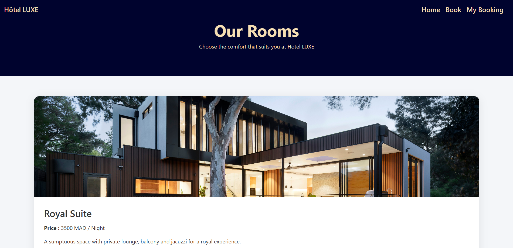

# GestionHotel – Hotel Management System

## 📌 Project Overview

GestionHotel is a web-based hotel management system developed using PHP, HTML, CSS, and MySQL.  

The goal of this project is to manage hotel operations such as room display, reservations, and payment processing in a simple and efficient way.

This project was created for learning purposes and demonstrates backend development concepts using PHP and database integration.

---

## 🛠️ Technologies Used

- PHP
- HTML5
- CSS3
- MySQL
- XAMPP / WAMP (Local Server)

---

## 📂 Project Structure

```
GestionHotel/
│
├── page_acceuil.html
├── apropos.html
├── services.html
├── chambre.php
├── reservation.php
├── liste_reservation.php
├── traitement_paiement.php
├── db.php
├── paiement.html
├── paiements.txt
├── images/
└── style/
```


### File Description

- **db.php** – Database connection
- **chambre.php** – Room management and display
- **reservation.php** – Reservation form and logic
- **liste_reservation.php** – Reservation listing
- **traitement_paiement.php** – Payment processing
- **images/** – Project images
- **style/** – CSS styles

---


### 🏠 Home Page


### 🛏️ Rooms Page


```md

## ⚙️ Installation Guide

1. Clone the repository:

```bash
git clone https://github.com/CondoRHxH/GestionHotel.git
Move the folder into your htdocs directory (if using XAMPP).

Create a MySQL database.

Configure the database connection inside db.php.

Run the project in your browser:

http://localhost/GestionHotel

Features
Room display

Online reservation system

Payment simulation

Reservation listing

Simple and clean user interface

